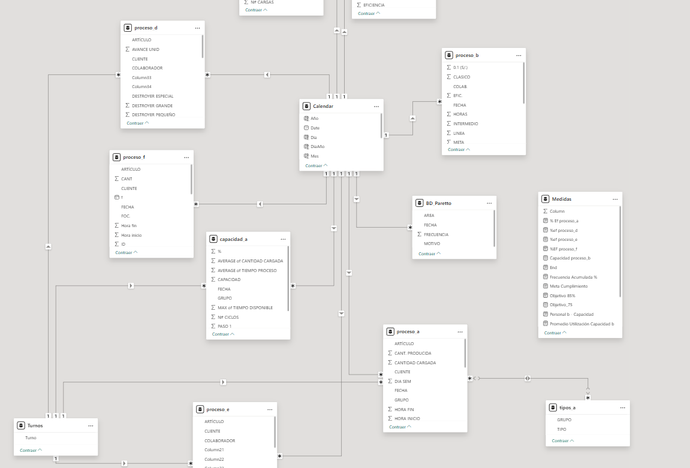

# Dashboard de Producción y Control Operativo

Este repositorio contiene dos dashboards construidos en Power BI, orientados al monitoreo de KPIs operativos en entornos industriales reales bajo procesos make-to-order (MTO).

Los dashboards se basan en datos simulados y anonimizados, y fueron desarrollados como parte de un sistema de mejora continua en una planta de producción textil.

---

## 🧠 Objetivos del proyecto

- Monitorear la **eficiencia diaria** por operario y por turno
- Visualizar la **producción vs. capacidad instalada** por proceso
- Analizar causas de ineficiencia mediante **gráfico de Pareto**
- Evaluar la **utilización de capacidad** de cada área
- Controlar el **cumplimiento de metas operativas** en tiempo real

---

## 🛠️ Tecnologías utilizadas

- Power BI Desktop
- DAX para medidas personalizadas
- Modelo de datos relacional con múltiples tablas
- Excel como fuente de datos (anonimizada)

---

## 📁 Estructura del repositorio

powerbi-kpis-produccion/
├── Dashboard_de_Producción.pbix # Dashboard principal de eficiencia y capacidad
├── Dashboard_control_salidas.pbix # Dashboard de seguimiento de entregas y cumplimiento
├── DAX_Medidas.md # Archivo con fórmulas DAX explicadas
├── README.md # Documento actual
│
├── data_produccion/ # Archivos de datos anonimizados
│ └── *.xlsx #Varios archivos .xlsx como fuente de datos
│
└── screenshots/ # Vistas de ejemplo del dashboard
├── dashboard_kpi_semanal.png
└── modelo_relacional_powerbi.png

---

## Vistas del Dashboard

### Indicador semanal de eficiencia

### Modelo relacional en Power BI

---

## 📘 Medidas DAX personalizadas

Se documentaron las principales medidas desarrolladas en el archivo [`DAX_Medidas.md`](./DAX_Medidas.md), incluyendo:

- Eficiencia por proceso
- Utilización de capacidad
- Frecuencia acumulada (Pareto)
- Cálculo de capacidad estimada

---

## 🔐 Nota sobre los datos

Todos los datos utilizados han sido **anonimizados**. Los nombres de clientes, operarios y procesos han sido reemplazados por alias.  
Este proyecto es de carácter demostrativo, con fines de portafolio profesional.

---

## 🙌 Autor

**Renzo Sánchez**  
[GitHub](https://github.com/renzosan25)  
📍 Lima, Perú  

