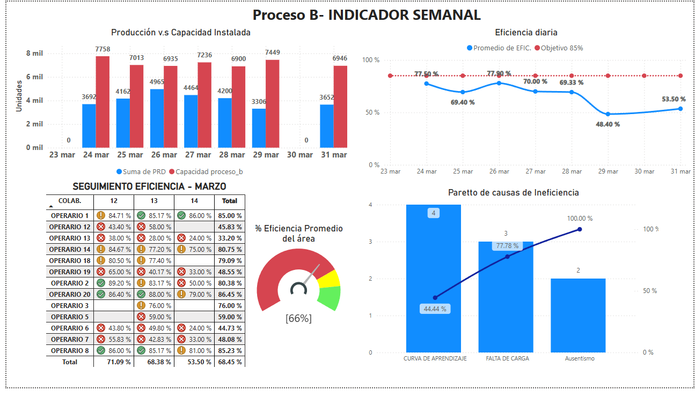

# 🔧 Industrial Production KPIs Dashboard (Power BI)

## 📋 Table of Contents

- [Overview](#overview)
- [Dataset Description](#dataset-description)
- [Technologies](#technologies)
- [Dashboard Views](#dashboard-views)
- [Data Modeling](#data-modeling)
- [DAX Logic](#dax-logic)
- [Getting Started](#getting-started)
- [Publication](#publication)
- [Disclaimer](#disclaimer)
- [Author](#author)

---

## 🧠 Overview

This Power BI project presents a complete dashboard system for monitoring key production indicators in an industrial setting using simulated and anonymized data.

The goal is to:
- Track production vs. installed capacity by process
- Monitor operator efficiency over time
- Evaluate process capacity utilization
- Visualize Pareto of inefficiencies
- Control theoretical vs. actual goal achievement

The model is designed for flexible use across multiple production areas (Processes A–F), and leverages strong DAX logic for accurate calculations and insight generation.

---

## 📊 Dataset Description

| Table            | Description                                                  |
|------------------|--------------------------------------------------------------|
| proceso_a – f    | Production data for each process (article, client, metrics)  |
| capacidad_*      | Theoretical process capacities by day and group              |
| BD_Paretto       | Inefficiency causes and frequencies                          |
| Calendar         | Standard calendar table with day, month, and year            |
| Turnos           | Shift information                                            |

📁 All data used is simulated and anonymized. See `/data_produccion` for details.

---

## ⚙️ Technologies

- Power BI Desktop
- Power Query (M)
- DAX
- Excel (as data source)
- GitHub (for version control and documentation)

---

## 🖼️ Dashboard Views

### 📈 Weekly KPIs – Process B

Includes:
- Production vs. Capacity bar chart
- Daily efficiency vs. target line chart
- Pareto of inefficiency causes
- Operator-wise efficiency table

---

## 🧩 Data Modeling

Features:
- Central `Calendar` table
- One-to-many relationships between processes and dimensions
- Centralized `Medidas` table for DAX measures
- Clean relational integrity and filter context design

---

## 📐 DAX Logic

Main measures are documented in [`DAX_Medidas.md`](./DAX_Medidas.md), including:

- Efficiency per process
- Capacity estimation based on minutaje
- Pareto frequency accumulation
- Capacity utilization across days

Each measure is structured and commented for clarity.

---

## ▶️ Getting Started

1. Clone this repository
2. Open `.pbix` files in Power BI Desktop
3. Keep `/data_produccion/` folder at the same level as the `.pbix` file
4. Refresh if needed (data is embedded, no external updates required)

---

## 🌐 Publication

Due to organizational account restrictions, the report is **not currently published to Power BI Public**.  
If enabled, the link will be added in [`link_dashboard_public.txt`](./link_dashboard_public.txt).

---

## 🔐 Disclaimer

All data has been **fully anonymized and simulated**. Client names, operator IDs, and process labels were replaced to protect confidentiality.  
This project is for educational and professional portfolio use only.

---

## 👤 Author

**Renzo Gabriel Sánchez Quispe**  
📍 Lima, Perú  
📫 renzosanchez201@gmail.com  
🔗 [GitHub Profile](https://github.com/renzosan25)

---
