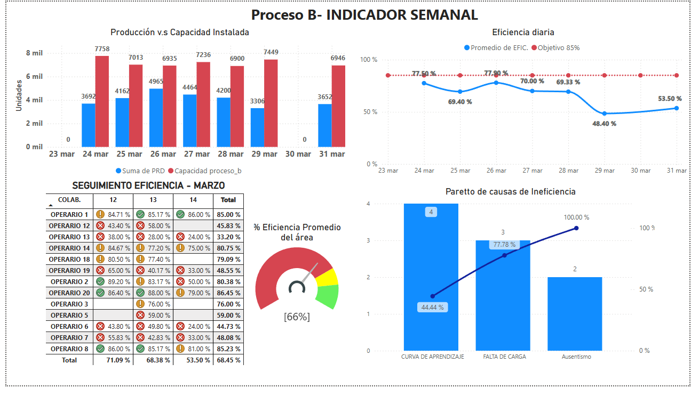
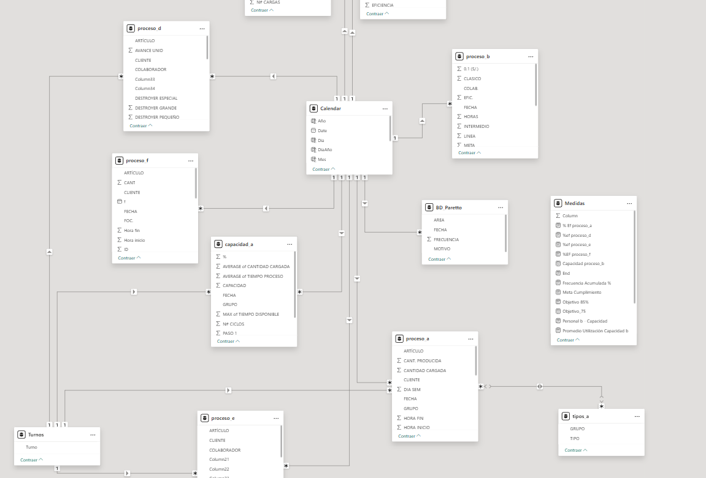
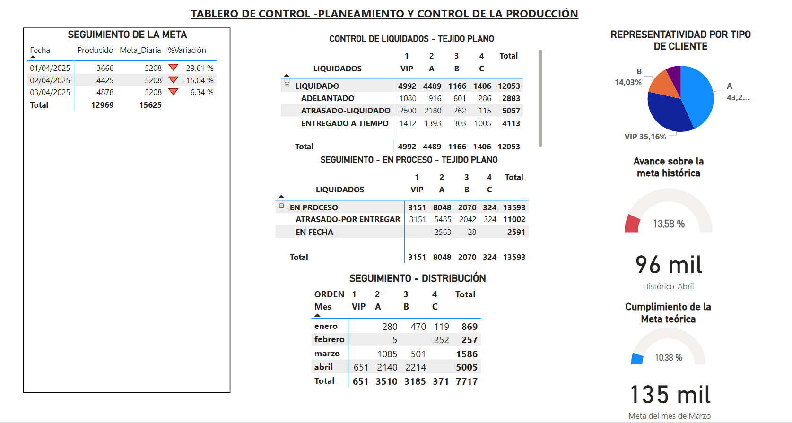

# Tablero de KPIs de Producción Industrial (Power BI)

## Tabla de Contenidos

- [Resumen](#resumen)
- [Descripción del Dataset](#descripción-del-dataset)
- [Tecnologías Utilizadas](#tecnologías-utilizadas)
- [Vistas del Tablero](#vistas-del-tablero)
- [Modelado de Datos](#modelado-de-datos)
- [Lógica DAX](#lógica-dax)
- [Aviso Legal](#aviso-legal)
- [Autor](#autor)
- [Ejemplo Adicional](#ejemplo-adicional--tablero-de-control-diario)

---

## Resumen

Este proyecto en Power BI presenta un sistema completo de tableros para monitorear indicadores clave de producción en un entorno industrial, utilizando datos simulados y anonimizados.

**Objetivos:**
- Seguir la producción vs. capacidad instalada por proceso
- Monitorear la eficiencia de los operadores a lo largo del tiempo
- Evaluar la utilización de la capacidad por proceso
- Visualizar un Pareto de causas de ineficiencia
- Controlar el cumplimiento de metas teóricas vs. reales

🔗 **Dashboard Principal:**  
[▶️ KPIs Semanales – Dashboard Interactivo en Power BI](https://app.powerbi.com/view?r=eyJrIjoiMzAxMjAyYzctMGM5My00NDk3LTg4NjAtN2I4ZmE4MDgwZjZkIiwidCI6IjdmMDBjMGNjLTE3NzgtNDBlOS1iMTAzLWU2N2Q1MGE0NWMwZSJ9)

---

## Descripción del Dataset

| Tabla            | Descripción                                                         |
|------------------|----------------------------------------------------------------------|
| proceso_a – f    | Datos de producción por proceso (artículo, cliente, métricas)       |
| capacidad_*      | Capacidades teóricas por día y grupo                                 |
| BD_Paretto       | Causas de ineficiencia y su frecuencia                               |
| Calendar         | Tabla calendario con día, mes y año                                  |
| Turnos           | Información sobre los turnos de trabajo                              |

Todos los datos son simulados y anonimizados. Revisa `/data_produccion` para más detalles.

---

## Tecnologías Utilizadas

- Power BI Desktop
- Power Query (M)
- DAX
- Excel (como fuente de datos)
- GitHub (para control de versiones y documentación)

---

## Vistas del Tablero

### KPIs Semanales – Proceso B  
[▶️ Ver Dashboard](https://app.powerbi.com/view?r=eyJrIjoiMzAxMjAyYzctMGM5My00NDk3LTg4NjAtN2I4ZmE4MDgwZjZkIiwidCI6IjdmMDBjMGNjLTE3NzgtNDBlOS1iMTAzLWU2N2Q1MGE0NWMwZSJ9)

Incluye:
- Análisis de producción vs. capacidad
- Eficiencia diaria vs. metas teóricas
- Desempeño por operador
- Gráfico de Pareto de causas de ineficiencia

---

## Modelado de Datos

- Tabla `Calendar` como eje central  
- Relaciones uno-a-muchos entre procesos y dimensiones  
- Tabla `Medidas` centralizada para las métricas DAX  
- Integridad relacional limpia y contexto de filtros bien definido  

---

## Lógica DAX

Documentada en [`DAX_Medidas.md`](./DAX_Medidas.md), incluyendo:

- Eficiencia por proceso
- Estimación de capacidad basada en minutaje
- Acumulación en Pareto
- Métricas de cumplimiento vs. meta

---

## Aviso Legal

Todos los datos han sido totalmente anonimizados y simulados.  
Los nombres de clientes, IDs de operadores y etiquetas de procesos fueron reemplazados para proteger la confidencialidad.  
Este proyecto es exclusivamente para fines educativos y de portafolio profesional.

---

## Autor

**Renzo Gabriel Sánchez Quispe**  
📍 Lima, Perú  
📫 renzosanchez201@gmail.com  
🔗 [Perfil de GitHub](https://github.com/renzosan25)

---

## Ejemplo Adicional – Tablero de Control Diario

Como ejemplo complementario, el siguiente tablero muestra un panel simplificado para el control diario de producción, utilizando una estructura plana de datos y lógica DAX básica.

🔗 [▶️ Tablero de Control Diario de Producción](https://app.powerbi.com/view?r=eyJrIjoiYzlkMmRhNGEtZWUwYy00MWNmLWE5YTItZGFiMjVlMmZlNTNlIiwidCI6IjdmMDBjMGNjLTE3NzgtNDBlOS1iMTAzLWU2N2Q1MGE0NWMwZSJ9)

Incluye:
- Seguimiento de producción diaria vs. metas
- Segmentación de salidas por cliente y estado
- Distribución mensual por grupo de cliente
- Indicadores de progreso y cumplimiento de metas

Este informe fue construido para visualizar métricas de alto nivel de forma rápida, sin aplicar modelado relacional ni lógica DAX avanzada.

---
